# TEMPLATE.AZURE.PLATFORM

This is a template repo for you to use to create your own Azure platform resources using Terraform. It is designed to work with both gitpod and github codespaces as well as deploy with github actions.

- [TEMPLATE.AZURE.PLATFORM](#templateazureplatform)
  - [What this template provides](#what-this-template-provides)
  - [Naming Conventions Used](#naming-conventions-used)
  - [Use as Template](#use-as-template)
  - [Create Azure Resources](#create-azure-resources)
  - [Update Common Variables](#update-common-variables)
  - [Develop with Gitpod](#develop-with-gitpod)
    - [Setup a Gitpod Prebuild](#setup-a-gitpod-prebuild)
  - [Develop with Github Codespaces](#develop-with-github-codespaces)
  - [Develop with VS Code Dev Containers](#develop-with-vs-code-dev-containers)
  - [Deploy with Github Actions](#deploy-with-github-actions)
    - [Setup Secrets and Variables](#setup-secrets-and-variables)
    - [Setup protected branch](#setup-protected-branch)
    - [Setup Environments](#setup-environments)
    - [Amend Workflow File](#amend-workflow-file)
  - [Importing Existing Azure Resources into Terraform](#importing-existing-azure-resources-into-terraform)
  - [FAQs](#faqs)
    - [How do I test from my dev environment before committing to the pipeline?](#how-do-i-test-from-my-dev-environment-before-committing-to-the-pipeline)
  - [What versions of tools do I have installed?](#what-versions-of-tools-do-i-have-installed)
    - [What if I need to migrate terraform state?](#what-if-i-need-to-migrate-terraform-state)
    - [What if I need to upgrade terraform versions?](#what-if-i-need-to-upgrade-terraform-versions)

## What this template provides

- Instructions on how to setup Azure credentials that is used to deploy infrastructure.
- Instructions on how to update common variables used in any developer environment.
- Instructions on how develop in different environments using gitpod, github codespaces and VS Code dev containers.
- A developer environment that includes the Azure CLI, Terraform and appropriate variables.
- An automatically deployed storage account to hold the terraform state.
- A github actions workflow to deploy the infrastructure.

## Naming Conventions Used

| Resource Type  | Convention  | Example Value  |
|---|---|---|
| State Resource Group | state-rg-{uniquenamespace} | state-rg-hngc |
| Resource Group | {env}-{domain}-rg-{uniquenamespace} | dev-platform-rg-hngc  |
| Resource with Hyphens | {env}-{domain}-{resourceshortcode}-{regionshortcode}-{uniquenamespace} | dev-beer-vnet-eun-hngc  |
| Resource without Hyphens | {env}{domain}{resourceshortcode}{regionshortcode}{uniquenamespace} | devbeersaeunhngc  |

If you want to amend the naming conventions used for the resources you deploy, you can do this in the [main.tf](./terraform/variables.tf) file.

I have chosen to use one storage account for state and separate the environments by containers. Each state file is then present as per the key in the [versions.tf](./terraform/versions.tf) file. This is a personal preference and you can choose to use a storage account per environment if you wish, but you will need to amend the code as necessary.

## Use as Template

1. Create a new repository in github.
2. Choose use template and select this repository.
3. Name your new repo appropriately.

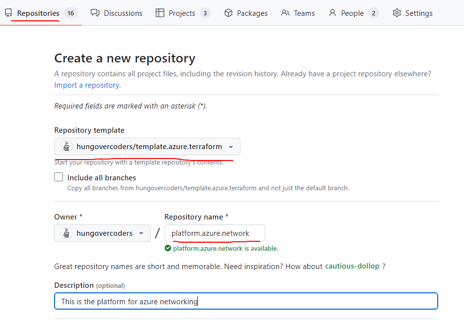

## Create Azure Resources

- You must have an [Azure subscription](https://portal.azure.com).
- You must have an application registration in Azure with the appropriate permissions to create resources in your subscription.
- You can create an application registration by running the a CLI command in a shell in the portal. Copy and paste the following code, but change your subscription name to be the one your using and set the app reg name to be what you require. It will also output the ARM_CLIENT_ID and ARM_CLIENT_SECRET which you can use to set the environment variables in the following sections.

```bash
SUBSCRIPTION_NAME="MySubscriptionName"
APP_REG_NAME=aprg-organisation-env-admin
az account set --subscription "$SUBSCRIPTION_NAME"
ARM_CLIENT_ID=$(az ad app create --display-name $APP_REG_NAME --query appId --output tsv)
echo "ARM_CLIENT_ID is..."
echo $ARM_CLIENT_ID
ARM_CLIENT_SECRET=$(az ad app credential reset --id $ARM_CLIENT_ID --append --years 1 --query password --output tsv)
echo "ARM_CLIENT_SECRET is..."
echo $ARM_CLIENT_SECRET
```

- If you are unsure where your app reg was created, you can find it [here](https://portal.azure.com/#view/Microsoft_AAD_IAM/ActiveDirectoryMenuBlade/~/RegisteredApps) in the Azure portal.

- You can then give it the appropriate role against the subscription (as an example using the command below):

**IMPORTANT:** I use "Owner" as a role in these examples as they are just development environments. You will likely want to limit access to your app registrations in reality to more appropriate roles.

```bash
az ad sp create --id $ARM_CLIENT_ID
az role assignment create --assignee $ARM_CLIENT_ID --role "Owner" --scope "/subscriptions/$ARM_SUBSCRIPTION_ID"
```

* You can also get the other Azure variables you need for the environment variables you need in the following sections below by running:

```bash
ARM_SUBSCRIPTION_ID=$(az account show --query id -o tsv)
echo "ARM_SUBSCRIPTION_ID is..."
echo $ARM_SUBSCRIPTION_ID
ARM_SUBSCRIPTION_NAME=$(az account show --query name -o tsv)
echo "ARM_SUBSCRIPTION_NAME is..."
echo $ARM_SUBSCRIPTION_NAME.
ARM_TENANT_ID=$(az account show --query tenantId -o tsv)
echo "ARM_TENANT_ID is..."
echo $ARM_TENANT_ID
```

## Update Common Variables

1. You'll need to edit the [domain.env](domain.env) file to be appropriate domain and team for your new repo.

```bash
TEAM=myteam
DOMAIN=mydomain
```

**Top Tip!** You can edit github repos in the browser by changing the name of the repo url to be github.dev instead of github.com. e.g. https://github.dev/hungovercoders/terraform.azure.platform. This will open up the repo in VS Code in the browser and you can edit the files directly.

2. You'll need to edit the [versions.tf](terraform/versions.tf) file to have the correct key for your state. e.g.

```yml
backend "azurerm" {
    key = "platform.azure.myinfrastructure.tfstate"
  }
```

This value wil be what we see later is the file name in the appropriate container of the storage account that holds the state.

## Develop with [Gitpod](gitpod.io)

1. If you haven't already, add the following environment variables to your [gitpod environment](https://gitpod.io/user/variables):

| Name  | Example Value  |
|---|---|
| ARM_CLIENT_ID  | da4ee6ba-7a57-11ee-b962-0242ac120002  |
| ARM_CLIENT_SECRET  |  ed72eb4c-7a57-11ee-b962-0242ac120002 |
| ARM_SUBSCRIPTION_ID  | e10bae2a-7a57-11ee-b962-0242ac120002  |
| ARM_SUBSCRIPTION_NAME  | MySubscription  |
| ARM_SUBSCRIPTION_ID  | e6288fd6-7a57-11ee-b962-0242ac120002  |
| ARM_REGION  | northeurope  |
| ENVIRONMENT | development |
| ORGANISATION | hungovercoders |
| UNIQUE_NAMESPACE | hngc |

These can be scoped however you need. For example, you can scope them to your [repository project](https://gitpod.io/projects), or to your [user](https://gitpod.io/user/variables).
Ensure the scope of the variables is also at the required level when using user variables. In this example below I have set the variables at the user level, because I use them consistently, but scoped them to my hungovercoders organisation repos. The Tenant is the same everywhere though which is why it scoped to all.

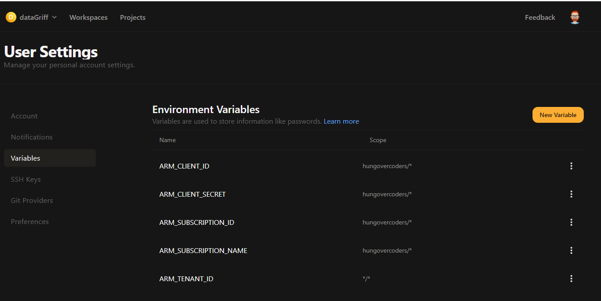

2. To develop with [gitpod](https://gitpod.io) you can either open the url of this repo prefixed with gitpod.io/# or you can use the [gitpod browser extension](https://www.gitpod.io/docs/configure/user-settings/browser-extension) to open the repo in gitpod.

3. Open in gitpod and you should see the following bash terminals:

a. **Azure CLI** - this will login to Azure using the service principal and set the subscription to the one specified in the environment variables.

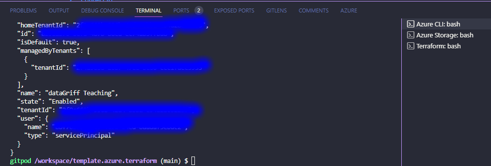

**Important:** If you wish to sign in to Azure using your own credentials as part of this process, you will want to change to use to the azure.sh script in the gitpod.yml instead of azure_sp.sh. This will prompt you to sign-in when you open up gitpod and the other tasks will not run until you have done this.

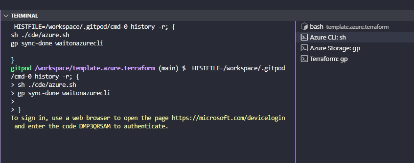

b. **Storage account** - which creates the storage account that will hold the terraform state.


You should see this deployed in Azure based on the environment variables you set earlier.

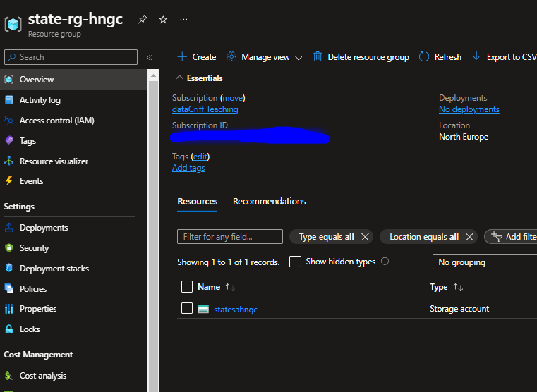

This will have a container for each environment.

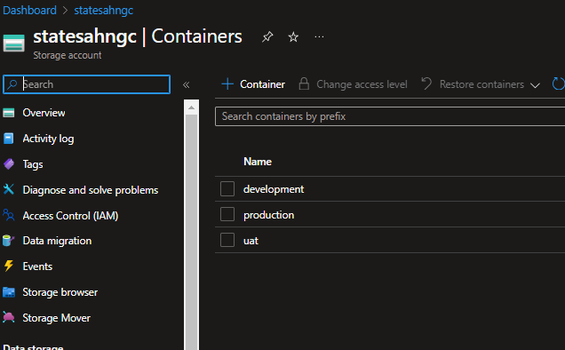

c. **Terraform** - which will run terraform init, format, validation and then terraform plan.


You should see the initial state file in the development container with the same name as the repo.


You have now successfully initialised a repo with gitpod and integrated resource state with your developer environment. To develop you can now start adding resources to the [main.tf](./terraform/main.tf) file and then run terraform plan and apply as you would normally.

### Setup a Gitpod Prebuild

In order to speed up your new environment when you go to use it again I recommend setting up a [gitpod prebuild](https://www.gitpod.io/docs/configure/projects/prebuilds). This will mean the development container is already built and ready to go when you open it up.

1. Create a project in gitpod and link it to your repo.

2. Configure prebuilds in the project.

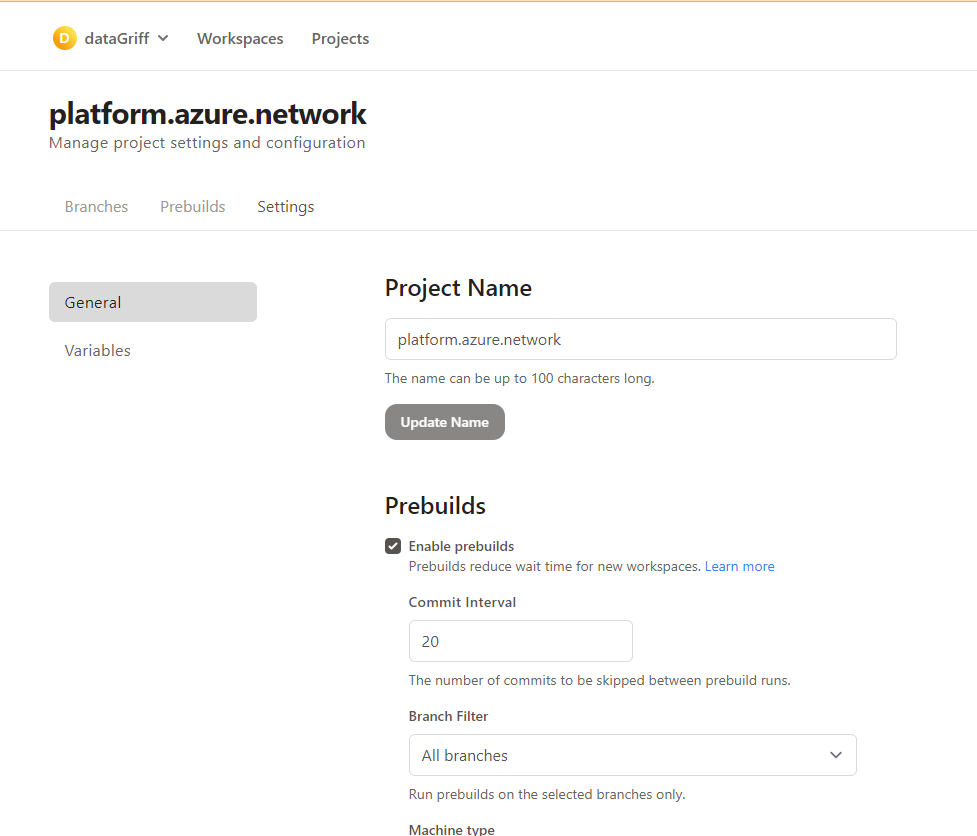

3. Run a prebuild now just to get it started.

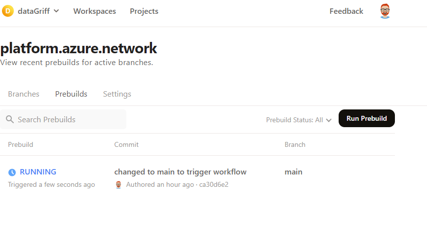

4. Open the project next time and you will have a much quicker statup as the container is already built.

## Develop with Github Codespaces

1. If you haven't already, add the following environment secrets to your github codespaces.

| Name  | Example Value  |
|---|---|
| ARM_CLIENT_ID  | da4ee6ba-7a57-11ee-b962-0242ac120002  |
| ARM_CLIENT_SECRET  |  ed72eb4c-7a57-11ee-b962-0242ac120002 |
| ARM_SUBSCRIPTION_ID  | e10bae2a-7a57-11ee-b962-0242ac120002  |
| ARM_SUBSCRIPTION_NAME  | MySubscription  |
| ARM_SUBSCRIPTION_ID  | e6288fd6-7a57-11ee-b962-0242ac120002  |
| ARM_REGION  | northeurope  |
| ENVIRONMENT | development |
| ORGANISATION | hungovercoders |
| UNIQUE_NAMESPACE | hngc |

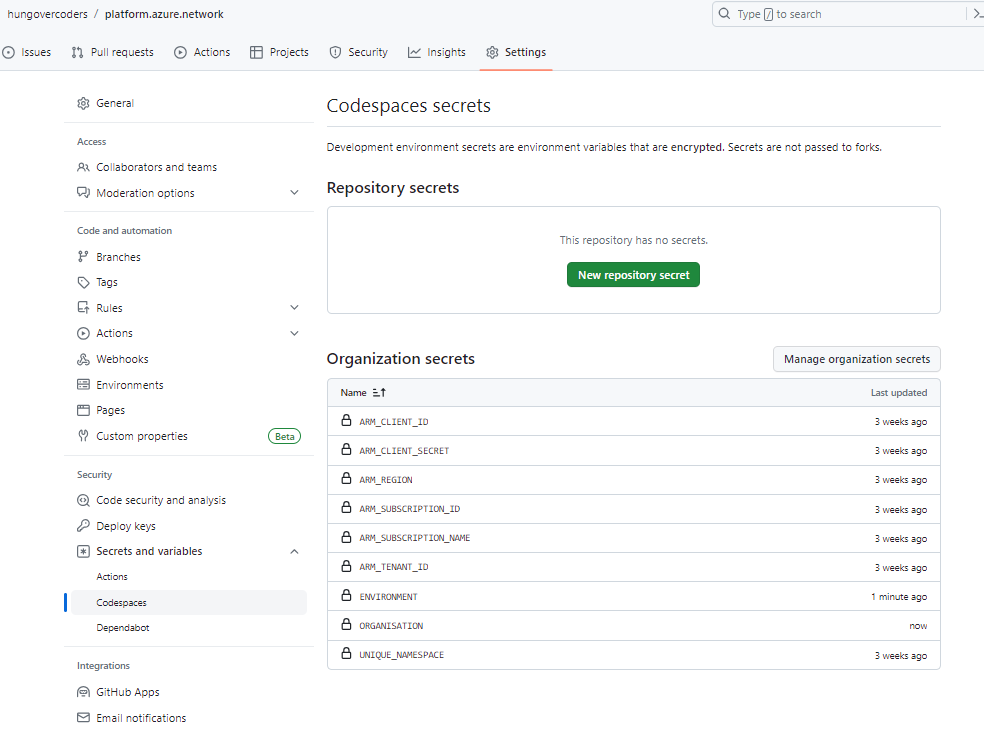

1. To develop with codespaces, click code on your repo and then click create codespace on main.

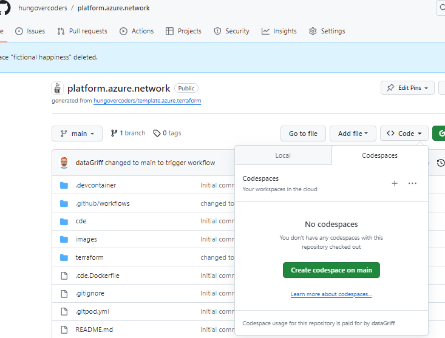

**Note:** I have been unable to automatically run the following scripts on startup so far, even though tried adding to the [devcontainer.json](.devcontainer/devcontainer.json) file. If you know how to do this, please let me know or contribute!

2. To enable the Azure CLI with the service account you created, execute the following in the terminal:

```bash
sh ./cde/azure_sp.sh
```

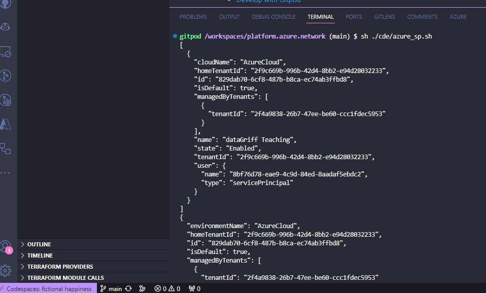

**Important:** If you wish to sign in to Azure using your own credentials as part of this process, you will want to change to use to the azure.sh script in the gitpod.yml instead of azure_sp.sh. This will prompt you to sign-in when you open up gitpod and the other tasks will not run until you have done this.

3. To create the storage account to hold state, run the following in the terminal:

```bash
sh ./cde/storage.sh
```

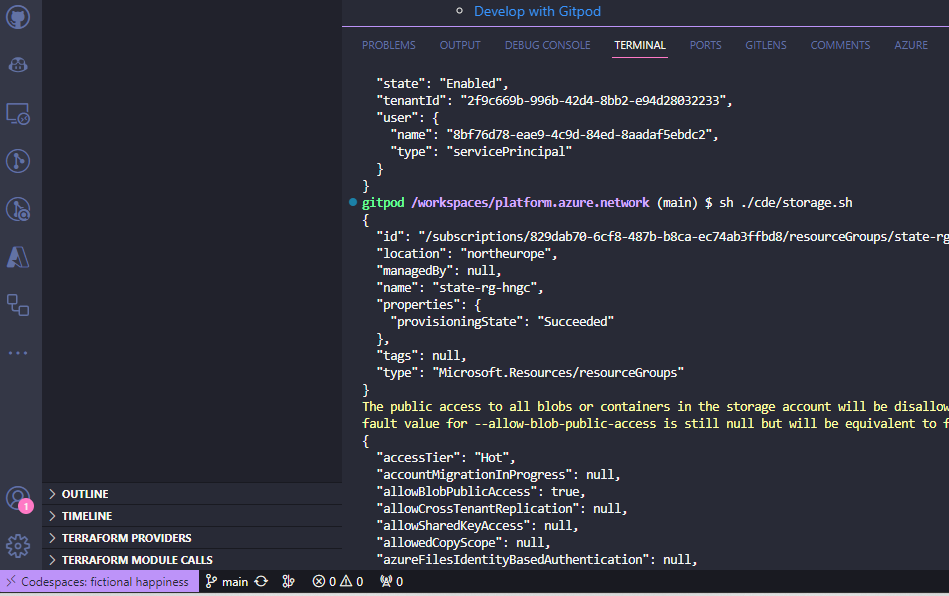

4. To initialise terraform, run the following in the terminal:

```bash
sh ./cde/terraform.sh
```

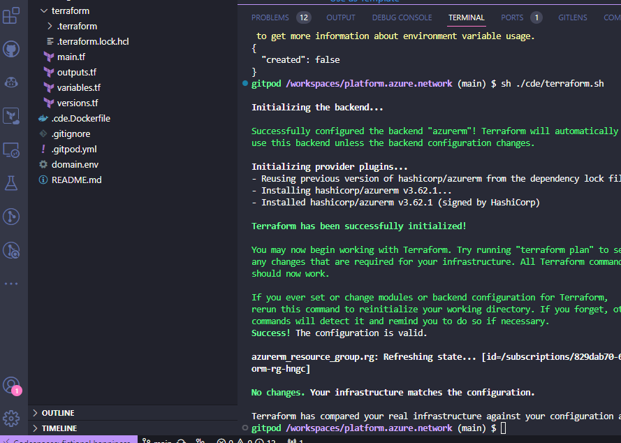

You have now successfully initialised a repo with codespaces and integrated resource state with your developer environment. To develop you can now start adding resources to the [main.tf](./terraform/main.tf) file and then run terraform plan and apply as you would normally.

## Develop with VS Code Dev Containers

TBC

## Deploy with Github Actions

### Setup Secrets and Variables

In the following you can choose to scope your secrets and variables at the repository or organisation level depending on your security needs. You could also leverage environment level secrets and variables if you wished as per the section after this.

1. If you haven't already, add the following environment secrets to your github actions secrets. You can do this by going to your repo, clicking on settings and then secrets. Go to actions and you can then add the following secrets:

| Name  | Example Value  |
|---|---|
| ARM_CLIENT_ID  | da4ee6ba-7a57-11ee-b962-0242ac120002  |
| ARM_CLIENT_SECRET  |  ed72eb4c-7a57-11ee-b962-0242ac120002 |
| ARM_SUBSCRIPTION_ID  | e10bae2a-7a57-11ee-b962-0242ac120002  |
| ARM_SUBSCRIPTION_NAME  | MySubscription  |
| ARM_SUBSCRIPTION_ID  | e6288fd6-7a57-11ee-b962-0242ac120002  |

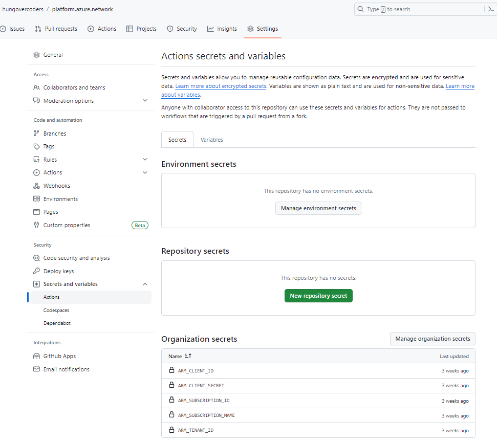

2. If you haven't already, add the following environment variables to your github actions variables. You can do this by going to your repo, clicking on settings and then secrets. Go to actions and you can then add the following variables:

| Name  | Example Value  |
|---|---|
| ARM_REGION  | northeurope  |
| ORGANISATION | hungovercoders |
| UNIQUE_NAMESPACE | hngc |


### Setup protected branch

In order to protect your main branch from being deployed to without a pull request, you can setup a protected branch. You can do this by going to your repo, clicking on settings and then branches. You can then add a branch protection rule for main.

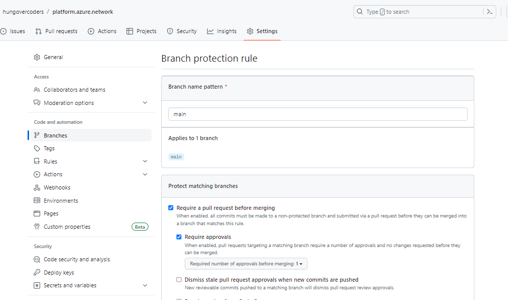

### Setup Environments

In order to use environments in github actions you will need your repository to be public if you are using a free github account. If you are using a paid account you can use private repositories.

1. Go to your repo and click on settings and then environments. Click on new environment and create an environment called development.

2. Set the environment value to be "development".

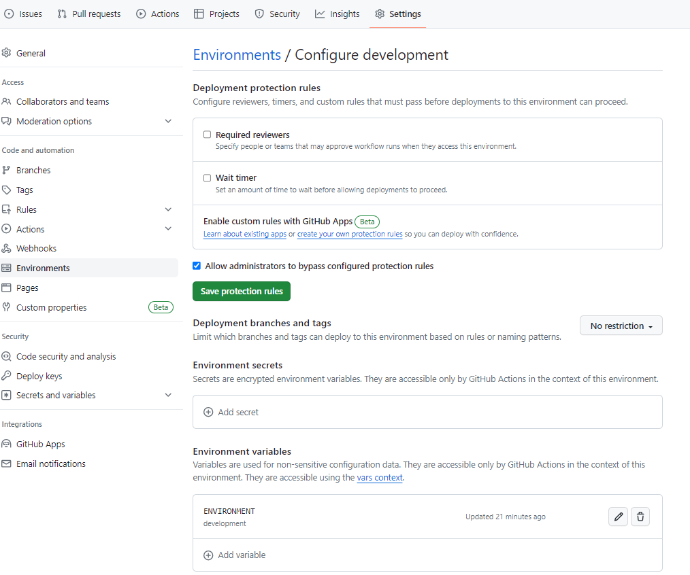

3. Go to your repo and click on settings and then environments. Click on new environment and create an environment called production-plan. This is to allow plans to occur against production when not in the main branch (as we protect this branch in the following task).
  
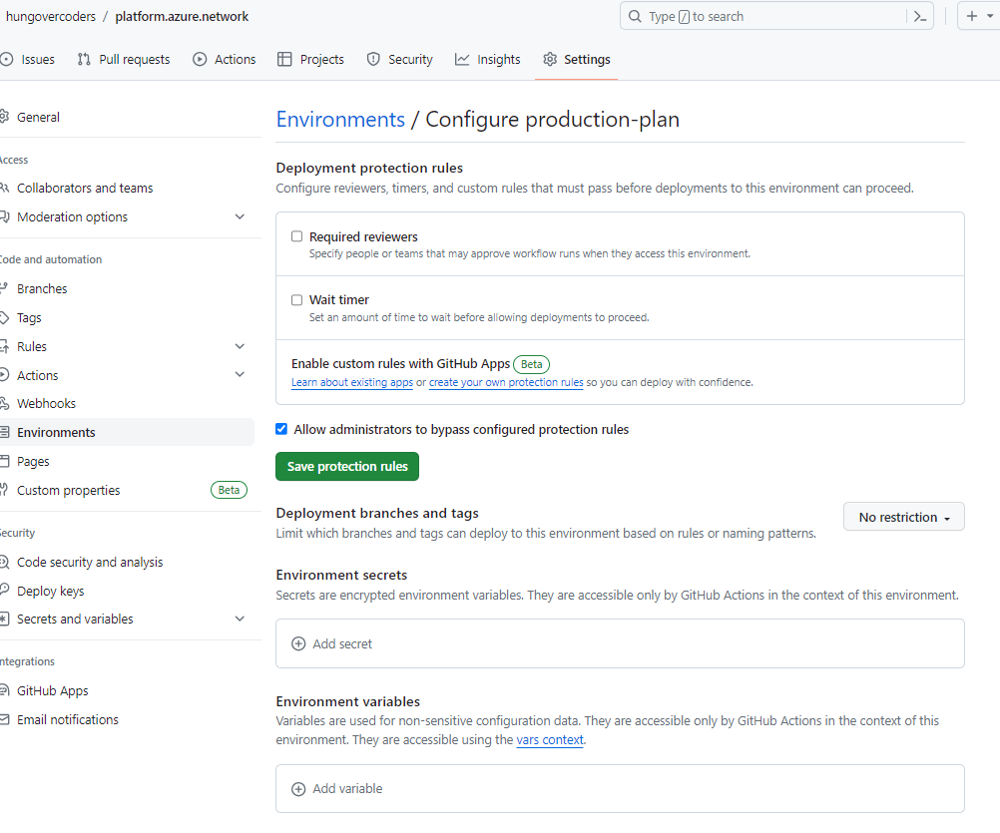

4. Go to your repo and click on settings and then environments. Click on new environment and create an environment called production.

5. Set the environment value to be "production".

6. Protect this environment by adding 1 protection rule for the production branch. This will mean that only protected branches (main configured earlier) can deploy to production.

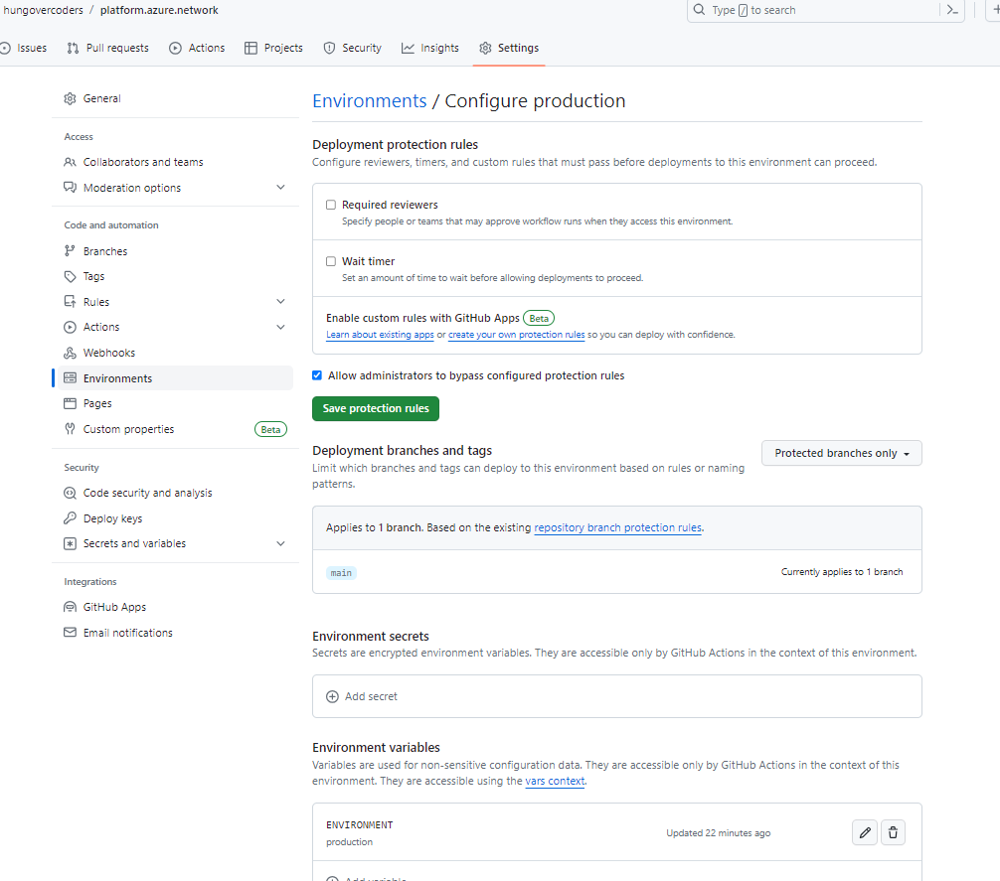

### Amend Workflow File

1. In order to make the actions trigger appropriately on pull request or committing to main, you will need to amend the [terraform.yml](.github/workflows/terraform.yml) file to have the appropriate default branches instead of the placeholders e.g.

```yaml
on:
  push:
    branches:
      - main
  pull_request:
    branches:
      - main
  workflow_dispatch:
```

This means that the workflow will run on push to main, pull request to main and manually when you click the run workflow button.

2. You can now commit your changes to main and the workflow will run. You can see the workflow running in the actions tab of your repo.

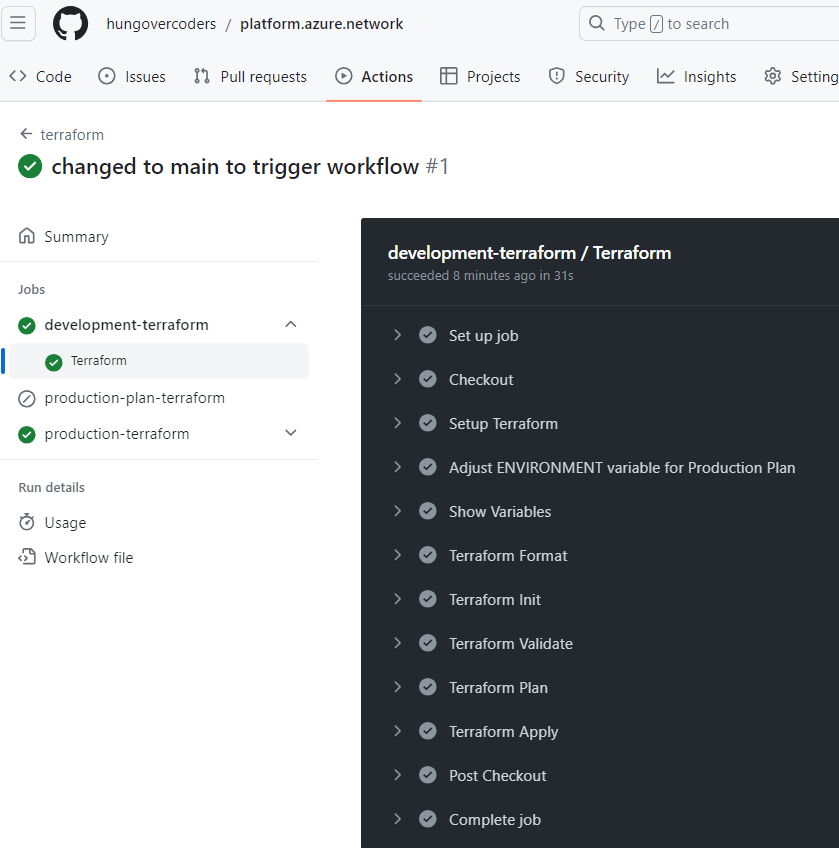

3. On raising  a pull request will deploy to your developer environment and generate a production plan only as part of the workflow.


4. A commit to main will deploy to your developer environment and deploy to production as part of the workflow.

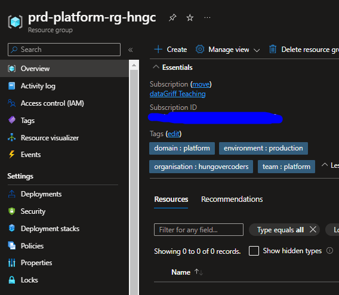

## Importing Existing Azure Resources into Terraform

If you have existing resources in Azure that you want to import into terraform, you can use the tool [aztfexport](https://github.com/Azure/aztfexport) which also comes configured with this developer environment.

It is very simple to use and to import an existing resource group you can use the permissions already established in the environment in the previous steps.
First ensure you have an empty directory and navigate to that directory by running the following in a terminal:

```bash
mkdir tfexport
cd tfexport
```

Then run the following command from that directory with the rg parameter taking in the resource group you want to import. The below imports a resource group called "dev-containerapp-rg-hngc" from the subscription we have authenticated against in the previous setup steps.

```bash
aztftexport rg dev-containerapp-rg-hngc
```

You should see "initializing" in the terminal. 

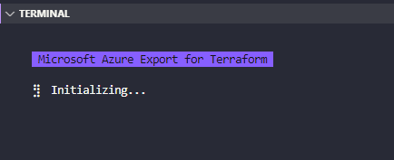

Often there are a load of "skips" you might see as it does not import everything. There are a number of options present though and so I choose "w" which is the import all option.

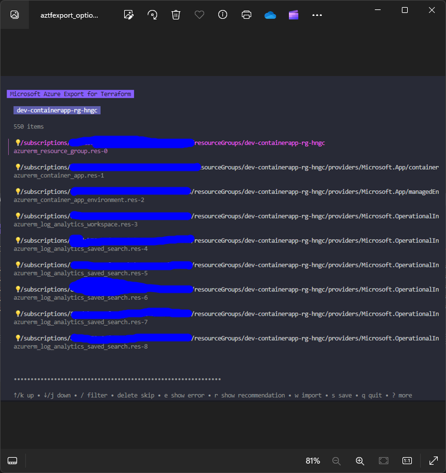

You'll then see "importing" if it has kicked off correctly.


After a period you should see the appropriate terraform files in the directory that you can use as a starting point.


You can then run a terraform plan to validate the infrastructure is as you expect with "no changes" in the output.

```bash
terraform plan
```


From here you can move the files into the template "terraform" location and leverage everything that has already been setup in this repo, running terraform plan and apply as you would normally while you develop.

I recommend reading further the [microsoft documentation](https://learn.microsoft.com/en-us/azure/developer/terraform/azure-export-for-terraform/export-terraform-overview) and the github [repo](https://github.com/Azure/aztfexport) for the tool to understand how to use it further and for any updates.

## FAQs

### How do I test from my dev environment before committing to the pipeline?

The best way to test loin your dev environment is to use the same commands that the github action pipeline uses that are stored in the cde/* files.

To perform a terraform plan run:

```bash
sh ./cde/terraform.sh
```

To perform a terraform apply run:

```bash
sh ./cde/terraform.sh True
```

The True denotes a parameter to perform apply as well as all the plans.

Utilising these files not only keeps the pipelines dumb but also ensures you are testing in your dev environment in the same way as the pipeline will run.

## What versions of tools do I have installed?

You can see the versions of tools installed either as part of the bash that runs on startup that you will see as a "Versions" terminal or you can run the file it references in a new terminal:

```bash
sh ./cde/versions.sh
```

### What if I need to migrate terraform state?

If you get an issue where terraform says you need to migrate the state, you can run:

```bash
terraform init -migrate-state
```

### What if I need to upgrade terraform versions?

If you get an issue where terraform says it doesn't support a particular resource, upgrade the [versions.tf file](./terraform/versions.tf) to the latest version of what you need and then run: 

```bash
terraform init -upgrade
```
